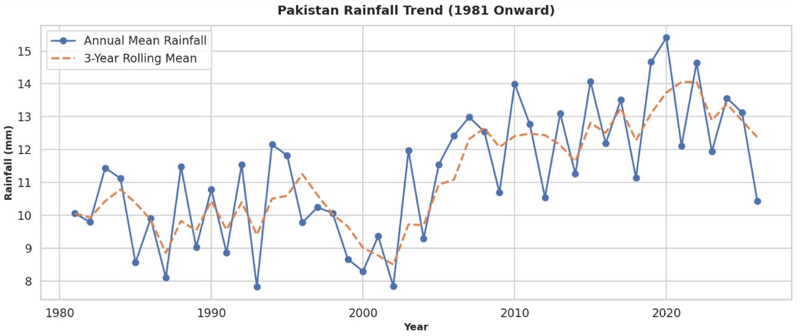

# Rainfall Prediction Model for Pakistan

## Overview

A machine learning system that predicts rainfall probability across Pakistan by combining real-time weather API data with historical rainfall trend analysis. The model compares multiple classifiers and automatically selects the best-performing one to generate next-day and multi-day rainfall predictions.

**Study Area:** Pakistan (national-level historical analysis; forecast module supports any city)  
**Duration:** April 2026 – May 2026  
**Role:** Solo project  
**Status:** Completed

---

## Methods & Tools

**Data Sources**

- Current and multi-day weather forecasts — retrieved via the WeatherAPI.com API using a custom `get_global_multi_day_weather` function (temperature, humidity, pressure, wind speed, wind direction, forecast data)
- Historical rainfall dataset — [WFP Rainfall Indicators: Pakistan (1981–2024)](https://www.kaggle.com/datasets/atifmasih/wfp-rainfall-indicators-pakistan-1981-2024) (Kaggle), used for trend analysis and visualization
- Historical weather dataset — a processed `weather.csv` dataset used for training the machine learning models

**Processing Steps**

1. Collect current weather data and forecasts through the WeatherAPI.com API
2. Load historical weather and rainfall datasets
3. Clean the datasets by removing missing values and duplicate records
4. Convert date fields and extract temporal features such as year and month
5. Encode categorical variables (e.g., wind direction)
6. Engineer predictive features including temperature, humidity, pressure, wind speed, and wind direction
7. Train and compare multiple machine learning models
8. Select the best-performing model
9. Predict rainfall probability and visualize historical rainfall trends using statistical and interactive graphs

**Tools Used**

| Tool | Purpose |
|------|---------|
| Python | Core programming language |
| pandas, NumPy | Data cleaning and processing |
| scikit-learn | Random Forest model training and evaluation |
| XGBoost | Gradient-boosted classifier for rainfall prediction |
| Matplotlib, Seaborn, Plotly | Statistical and interactive data visualization |
| pytz | Timezone handling for weather API data |

---

## Key Findings

- Compared Random Forest and XGBoost classifiers using accuracy and cross-validation, then automatically selected the higher-performing model
- Generated rainfall probability predictions for the next day and for multi-day forecasts
- Produced historical rainfall visualizations covering annual trends, monthly distributions, monsoon rainfall analysis, and flood-prone years across Pakistan

---

## Links

[View Code on GitHub](https://github.com/DanishTariq954/DanishTariq954.github.io.git){ .md-button }
[View Data Source](https://www.kaggle.com/datasets/atifmasih/wfp-rainfall-indicators-pakistan-1981-2024){ .md-button }
